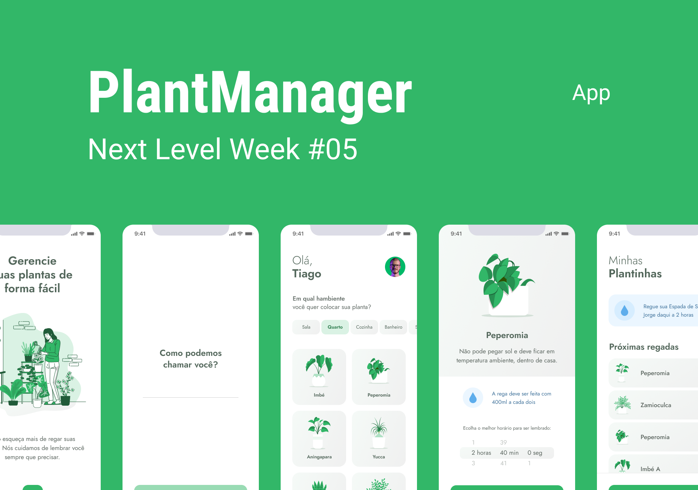

<h1 align="center">
    
</h1>

<p align="center">
  <a href="#-project">About</a>&nbsp;&nbsp;&nbsp;|&nbsp;&nbsp;&nbsp;
  <a href="#technologies">Technologies</a>&nbsp;&nbsp;&nbsp;|&nbsp;&nbsp;&nbsp;
  <a href="#-layout">Getting started</a>
</p>

<p align="center">
  
</p>

---

## About

🌱 An app to always remember to water your plants.

This app was developed during the 5th edition of **[Next Level Week](https://nextlevelweek.com/)**, presented by **[@Rocketseat](https://github.com/Rocketseat)** 

## Technologies

This project was developed using the following technologies:

- [Expo](https://expo.io/)
- [React Native](https://reactnative.dev/)
- [TypeScript](https://www.typescriptlang.org/)

## Getting started

You must install [Node.js](https://nodejs.org/) and [Expo CLI](https://docs.expo.io/). 

```bash
# Clone the project and access the folder
$ git clone https://github.com/gustavofadel/plantmanager.git && cd plantmanager

# Install the dependencies (if you have Yarn, you can use yarn install)
$ npm install

# Start the project
$ expo start
```

Don't forget to add your IP address in ./src/services/api.ts file :)

Open another bash and type this to use data from server.json:

```bash
# Using JSON Server
$ json-server ./src/services/server.json --host Your_IP_Address --port 3333
```

## Contact
E-mail: ghffadel@gmail.com
